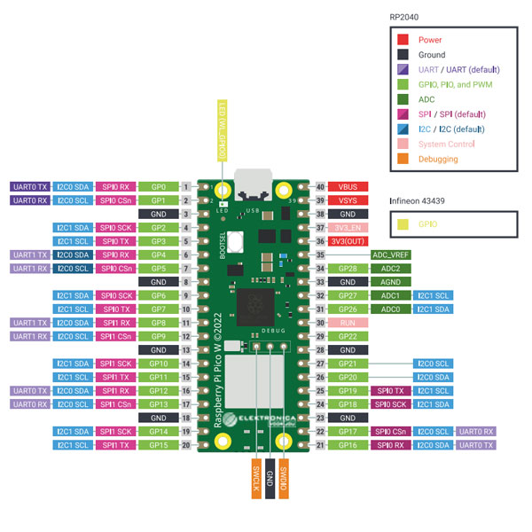
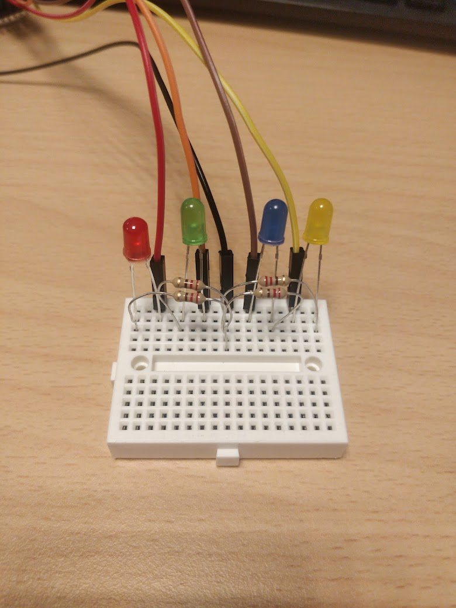
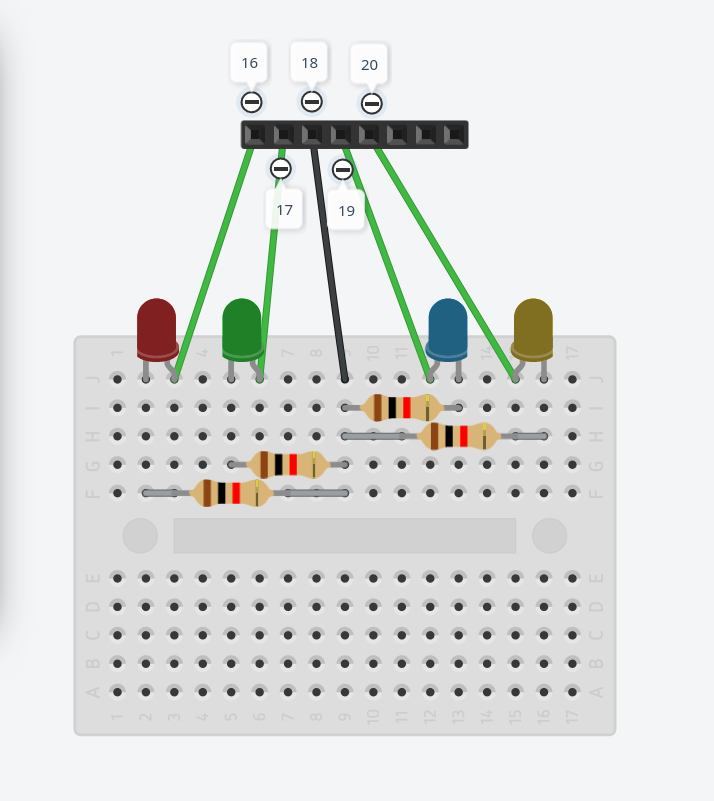
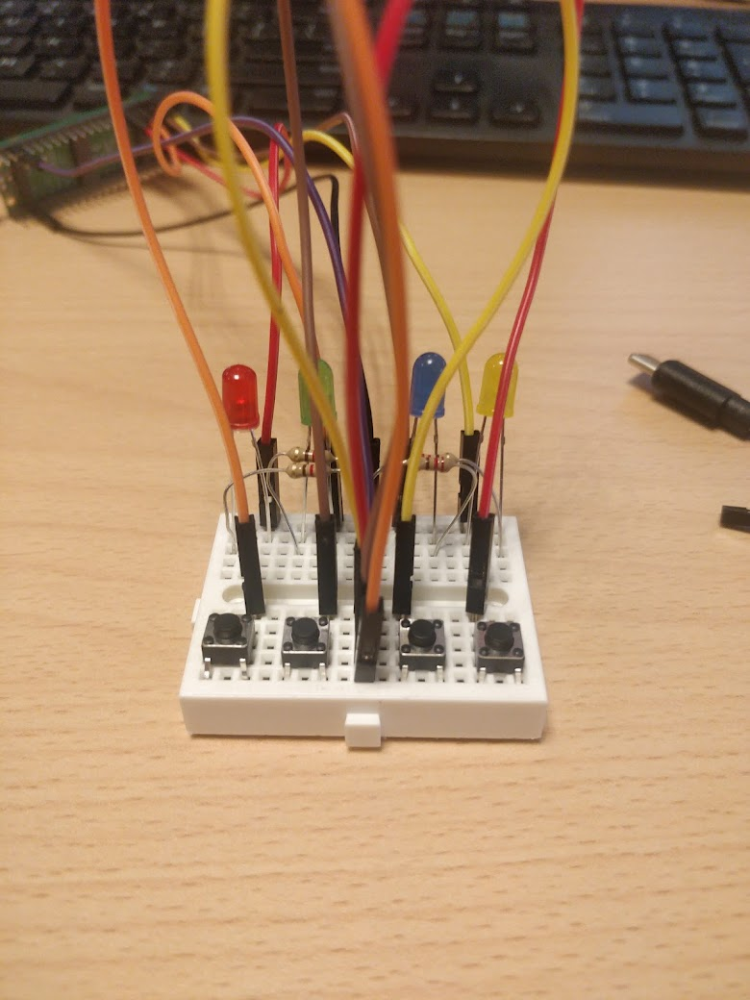
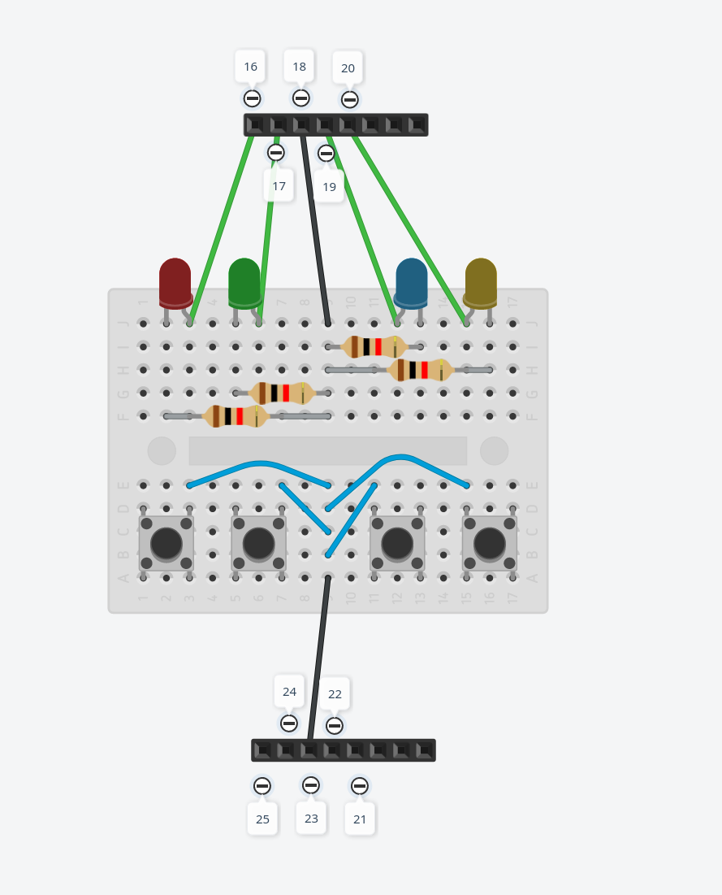
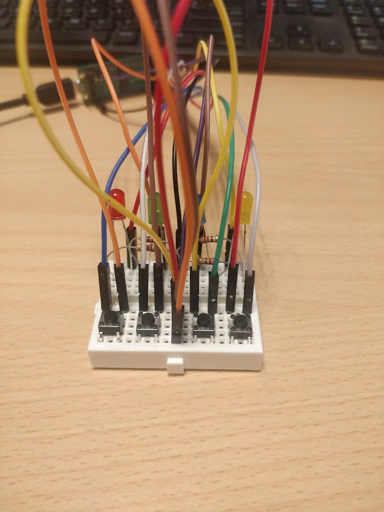
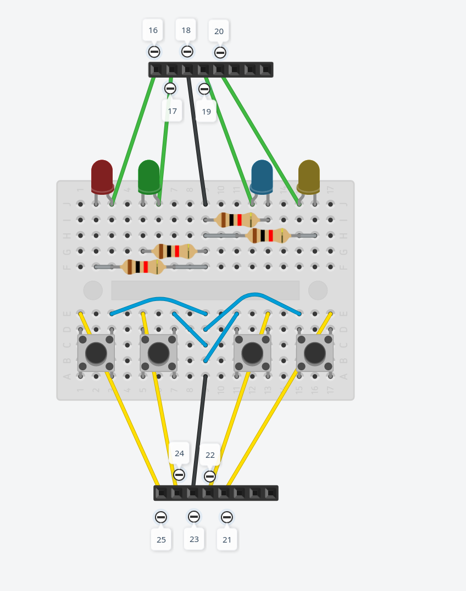

# Hardware
For pin layout of the RPI pico refer to: https://www.raspberrypi.com/documentation/microcontrollers/raspberry-pi-pico.html#pinout-and-design-files

One side of the breadboard will be used for the leds, the other side for the buttons.

## Hardware required (Provided):
- 1 Raspberry Pi Pico
- 1 USB Micro Cable
- 1 Breadboard
- 4x 220 Ohm resistor
- 1x Red led
- 1x Green led
- 1x Blue led
- 1x Yellow led
- 4x Push button
- 10 M-F jumper
- 4x M-M jumper

The raspberry pi pico looks like this:

Note: The **pin numbers** above differ from the **gpio numbers**. We will be referring to the pin numbers below.

## Leds
We will use one side of the breadboard for the leds, and the other side for the buttons.
These sides will only interact via the raspberry pi.

- Connect pin 16,17,19,20 to the positive side of the red,green,blue,yellow LEDs respectively.
- Connect the negative side of the leds to the center rail using the resistors.
- Connect center rail to ground at pin 18 ground (black wire on the picture).
- Your hardware should now look like this:

 

## Buttons

We will now connect the buttons, this will be a little messy because of all the jumpers involved.

- Place the 4 buttons on the breadboard as shown on the image.
- Using the M-M jumper wires, connect one side of the button to the center rail.
- Connect the center rail to pin 23 ground (purple wire on the picture).
- Your hardware should now look like this:

 

- Connect pins 25,24,22,21 to the other side of the buttons next to the red,green,blue,yellow leds respectively.
- The final hardware should look like this:

 

# Software

Installation:
- Install VS code with the rust plugin: https://code.visualstudio.com/
- Install rustup: https://rustup.rs/
- Run: `rustup target add thumbv6m-none-eabi`
- Run: `cargo install elf2uf2-rs`

Running:
- Unplug rpi
- Hold the bootsel button while plugging in the usb cable
- Run: `cargo run`

